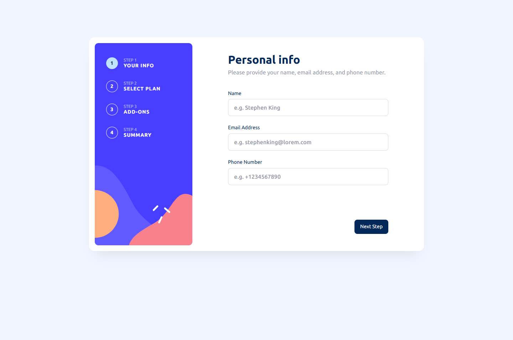
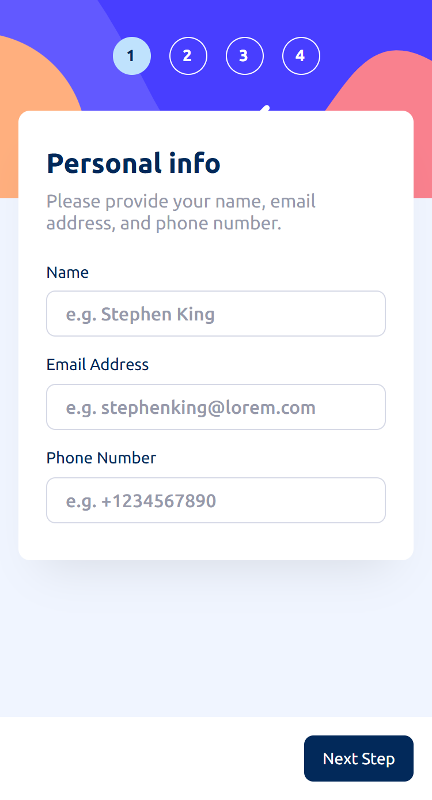

# Frontend Mentor - Multi-step form solution

This is a solution to the [Multi-step form challenge on Frontend Mentor](https://www.frontendmentor.io/challenges/multistep-form-YVAnSdqQBJ). Frontend Mentor challenges help you improve your coding skills by building realistic projects.

## Table of contents

-   [Overview](#overview)
    -   [The challenge](#the-challenge)
    -   [Screenshot](#screenshot)
    -   [Links](#links)
-   [Getting Started](#getting-started)
    -   [Built with](#built-with)
    -   [Useful resources](#useful-resources)
-   [Author](#author)

## Overview

### The challenge

Users should be able to:

-   Complete each step of the sequence
-   Go back to a previous step to update their selections
-   See a summary of their selections on the final step and confirm their order
-   View the optimal layout for the interface depending on their device's screen size
-   See hover and focus states for all interactive elements on the page
-   Receive form validation messages if:
    -   A field has been missed
    -   The email address is not formatted correctly
    -   A step is submitted, but no selection has been made

### Screenshot

<table>
 <tr>
    <th>Desktop</th>
    <th>Mobile</th>
  </tr>
  <tr>
    <td></td>
    <td></td>
  </tr>
</table>

### Links

-   Solution URL: [Link](https://github.com/olaide-hok/multi-step-form)
-   Live Site URL: [Link](https://your-live-site-url.com)

## My process

### Built with

-   Semantic HTML5 markup
-   CSS custom properties
-   Flexbox
-   CSS Grid
-   Mobile-first workflow
-   [React](https://reactjs.org/) - JS library
-   [Next.js](https://nextjs.org/) - React framework

### Useful resources

-   [Next.js Documentation](https://nextjs.org/docs) - learn about Next.js features and API.
-   [Learn Next.js](https://nextjs.org/learn) - an interactive Next.js tutorial.
-   [React Testing Library](https://testing-library.com/docs/react-testing-library/intro/) - The React Testing Library is a very light-weight solution for testing React components.
-   [Vitest](https://vitest.dev/guide/) - A testing framework powered by Vite.

## Author

-   Website - [Habeeb Kareem](https://habeeb-dev.netlify.app)
-   Frontend Mentor - [@olaide-hok](https://www.frontendmentor.io/profile/olaide-hok)
